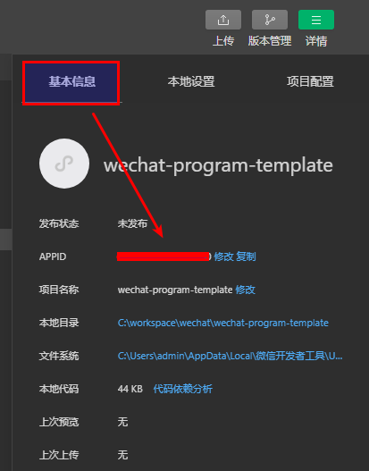

* 官方提供的wx.setStorageSync方法有缺陷，不能设置过期参数，只能数据中存储过期时间，取出数据时判断数据的过期时间
* 不同小程序wx.setStorageSync的本地存储是共用一套，同名的key会覆盖其他人的小程序，要添加一个keyPrefix作为前缀
* new Date().getTime()才是返回毫秒级的时间戳long类型，new Date().getMilliseconds()返回当前时间的毫秒部分，取值在0到1000范围
* wx.getSetting可以让小程序客户端获取到用户信息，但是服务端无法判断是否正确，必须通过授权码方式获取用户信息，然后给小程序发放token

* 小程序的授权接口错误提示是个巨坑，https://api.weixin.qq.com/sns/jscode2session?appid=aappid&secret=secret&js_code=xxxx&grant_type=authorization_code
#### 右上角的详情配置信息的基础信息，appID必须和jscode2session的URL的appid取值一样，否则会抛40126的code码错误，提示js_code编码不正确，坑爹货，居然不提示appId和secret参数错误
#### 获取appid和secret的地址 https://mp.weixin.qq.com/wxamp/devprofile/get_profile

##### 通过授权码，appId，sppsecret来校验微信登陆，不需要用户授权，不需要用户进行授权操作，每次进入都要校验一次，或者每次进入小程序先从缓存拿旧的token信息，拿不到再进行授权操作
##### wx.getUserInfo才需要用户进行授权操作